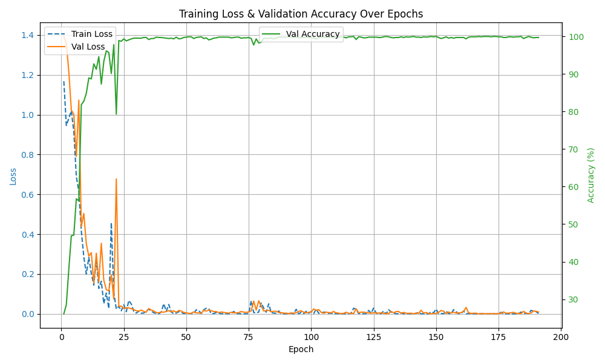
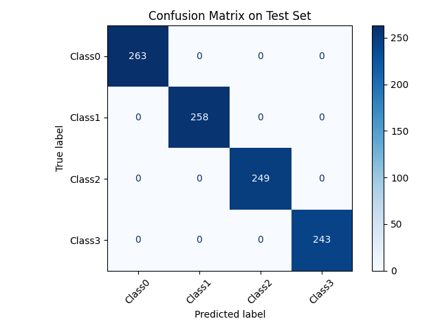

# Overview

欢迎使用本项目！本文件在AI协助下生成。

---

## 📥 下载数据集

请从以下链接下载`.mat`格式的原始数据文件：

🔗 [数据集下载页面（Zenodo）](https://zenodo.org/records/7674842)

下载完成后，请将`.mat`文件放置在项目根目录下的`original_dataset/`文件夹中：

```
project/
├── original_dataset/
│   ├── EC1.mat
│   ├── EC2.mat
│   └── EC3.mat
├── README.md
└── ...
```

---

## 🖼️ 模型诊断图像展示

以下是模型训练过程中的关键表现图像：

### 📉 Loss & Accuracy 曲线

展示训练与验证过程中的损失和准确率变化，有助于判断模型是否过拟合或欠拟合。

- 8通道

- 4通道

- 2通道


---

### 🧠 测试集混淆矩阵

用于评估模型在各类别上的预测准确性，揭示分类错误的分布情况。


